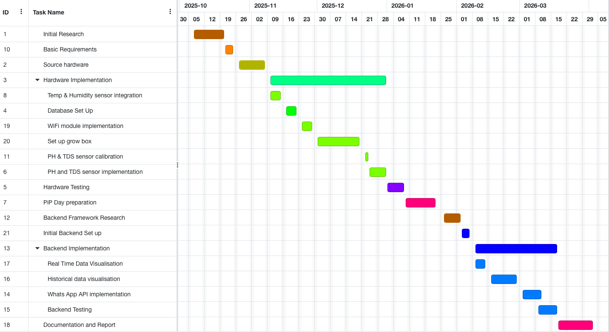
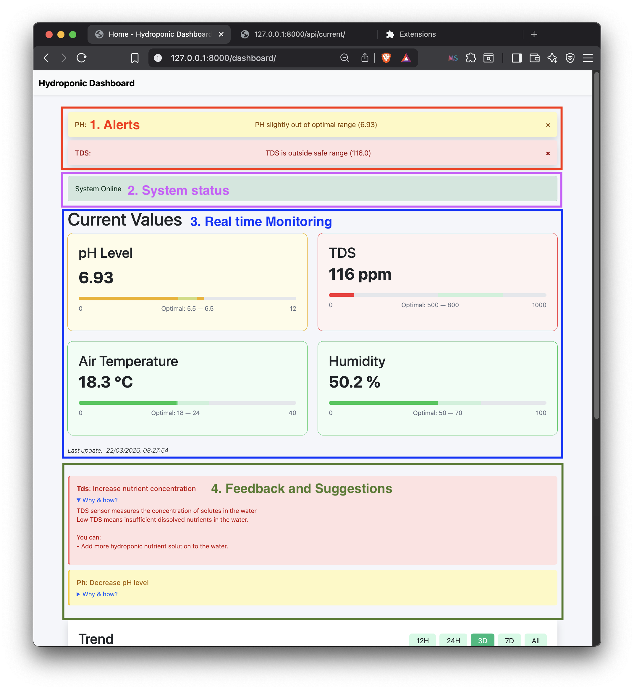
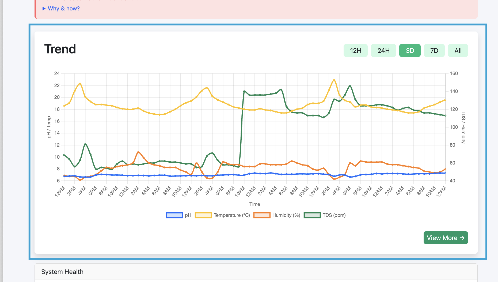
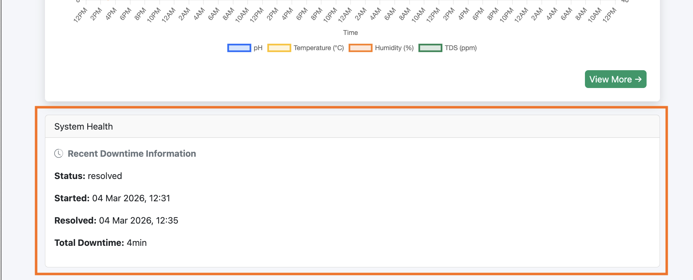
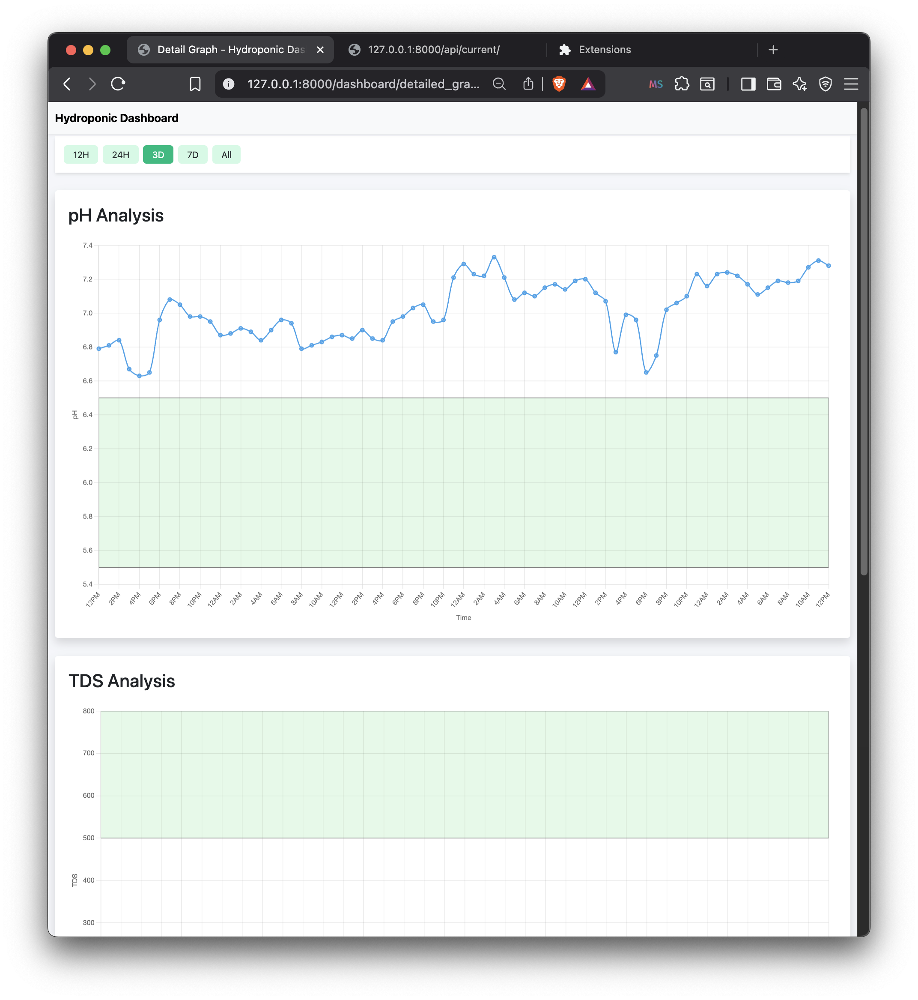

# Web-Based Monitoring for Hydroponics

## UFCFXK-30-3 Digital System Project

Aliff Fayruz (24008753)

## Overview

The final code used for the Arduino and ESP32 are located in ('arduinoIDE/Main')

The backend development, which used the Python Django Framework, is located under web.

### Gant Chart

## Screenshots of dashboard
System status, alerts, live monitoring and feedback:

Chart used to view historical data:

System information logged by the system:

Detail graph page:
